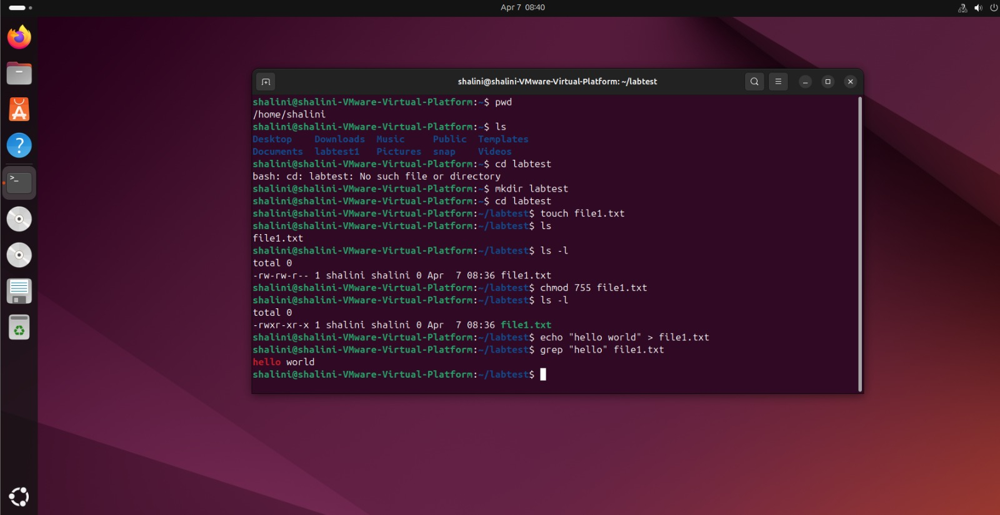

# 🛒 SmartCart - Online Shopping Website

## 📌 Project Overview

SmartCart is a full-stack online shopping web application inspired by platforms like Amazon and Flipkart. The system allows users to browse products, add items to a cart, and place orders.

---

## 🎯 Objectives

* Develop a functional e-commerce website
* Implement frontend, backend, and database integration
* Deploy the application on a Linux server environment

---

## 🧩 Features

* User registration and login
* Product listing
* Add to cart
* Order management

---

## 🏗️ Technologies Used

* HTML, CSS, JavaScript
* Node.js
* MongoDB / MySQL
* Ubuntu Linux

---

## 🗂️ Project Structure

online-shopping-project/
│
├── frontend/
├── backend/
├── database/
├── screenshots/
│   └── linux.png
└── README.md

---

## 🐧 Linux Server Environment

The project was tested in an Ubuntu Linux environment. Commands like mkdir, touch, chmod, and grep were used for file management and permissions.

---

## 📸 Linux Server Output

---

## 🧠 Learning Outcomes

* Linux command-line operations
* GitHub documentation
* Basic web development
